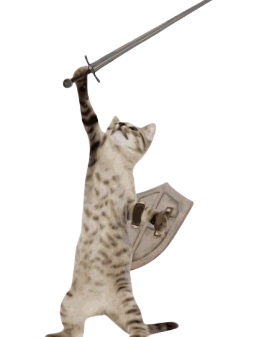

<div align="center">
  
# Hi, I'm João Barreto


</div>

---

## About Me

Currently studying **Multiplatform Software Development** at Fatec Registro, I'm passionate about building scalable solutions and exploring cutting-edge technologies. When I'm not coding, you'll find me reading manga or playing basketball.

<div align="right">
  
</div>

## Tech Stack


## Areas of Interest



```typescript
const interests = {
  cloudComputing: ["AWS", "Serverless", "Microservices"],
  iot: ["Edge Computing", "Sensor Networks"],
  ai: ["Machine Learning", "Automation"]
};
```

<br clear="right"/>

## GitHub Stats

<div align="center">
  <a href="https://awesome-github-stats.azurewebsites.net/index.html??cardType=level&theme=onedark&showIcons=false&preferLogin=true">
    
  </a>
</div>

## Let's Connect

<div align="center">
  
[](https://www.instagram.com/akabarreto/)
[](https://www.linkedin.com/in/jaobarreto/)
[](mailto:joaobarretoprof@gmail.com)
[](https://github.com/jaobarreto)

</div>

